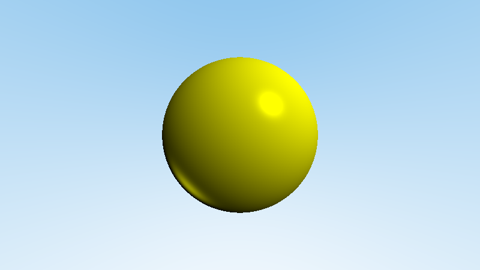
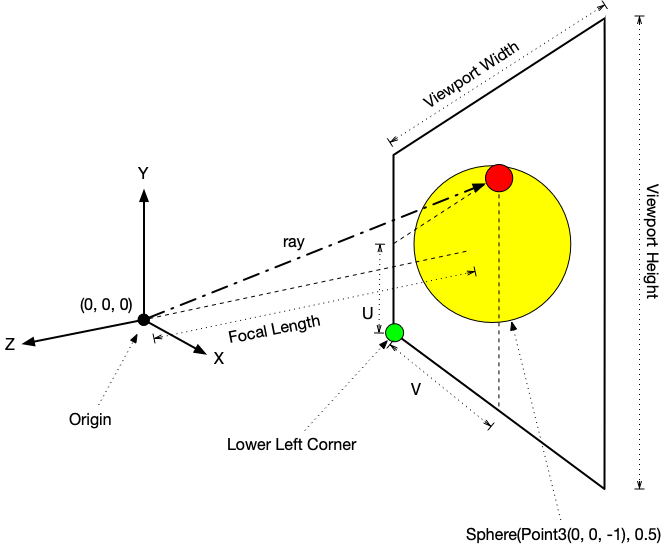
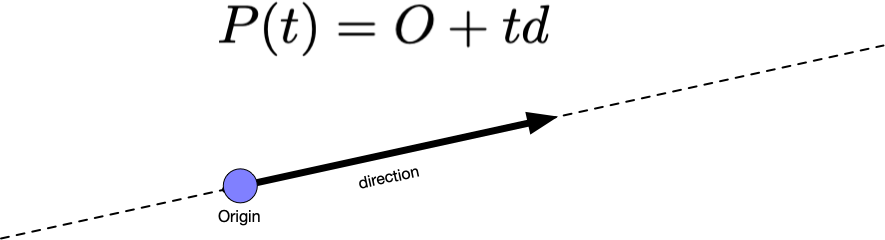
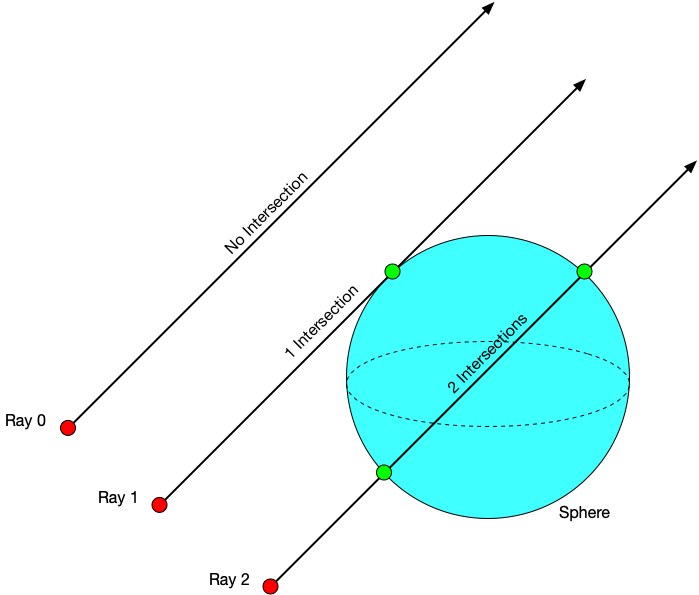
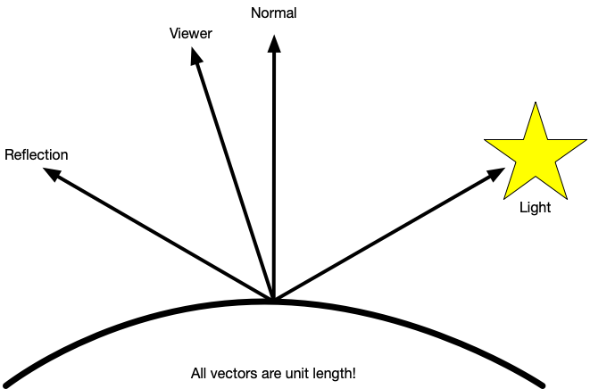

# Rendering A Sphere

This time around we will ray trace a sphere and shade it using the [Phong Reflection model](https://en.wikipedia.org/wiki/Phong_reflection_model).

If you use the blue sky from last week's exercise and use a yellow sphere, then your output will look a little like the image below.



There is quite a bit going on in this image that we'll have to program. Don't worry if you didn't get last weeks exercise perfect. The parts that you absolutely need from last week are included in this week's exercise.

This time around we're drawing a sphere. The sphere is specified in `rt.cc` as the world.

```c++
  /// World definition in main
  auto world = Sphere(Point3(0, 0, -1), 0.5);
```

The sphere is located at (0, 0, -1) and has a radius of 0.5.

Our camera definition is just like it was last week.

```c++
  // Camera definition in main
  const double kViewportHeight = 2.0;
  const double kViewportWidth = kAspectRatio * kViewportHeight;
  const double kFocalLength = 1.0;
  const Point3 kOrigin{0, 0, 0};
  const Vec3 kHorizontal{kViewportWidth, 0, 0};
  const Vec3 kVertical{0, kViewportHeight, 0};
  const Vec3 kLowerLeftCorner =
      kOrigin - kHorizontal / 2 - kVertical / 2 - Vec3(0, 0, kFocalLength);

```

Updating our diagram from last week, we have the camera looking through our viewport at the sphere floating in space -1 unit away from the camera's center.



From the camera, we'll generate rays which will either hit the sphere or miss the sphere. If the ray, misses the sphere then we will use the code we developed last week to shade in the sky. If the ray hits (intersects) the sphere we will calculate the color of the sphere. In the diagram, you can see that there is a ray that intersects the sphere at the red dot and that red dot represents a hit.

## Ray - Sphere Intersection

In order to figure out where a ray hits a sphere we need to do a little bit of math.

Last time, we learned that you can think of a ray as a parametric equation for a line:


The ray is made up an origin _O_ and a direction _d_. You can reach any point along the line that a ray defines by plugging in the value of _t_ that corresponds to that point. 



Notice that given positive values of _t_, you can stretch the ray along the dashed line in the direction of the arrow. Given negative values of _t_, you can stretch the ray in the opposite direction of the arrow.

Most of us leared that a sphere has the equation . This is a nice textbook definition however it will be very hard for us to come up with the math to calculate where, if at all, a ray intersects with a sphere.

Another way to express the equation for a sphere is as a [dot product](https://en.wikipedia.org/wiki/Dot_product). Let's imagine that our sphere is at the origin (0, 0, 0), let's call the center _C_, and it has a radius of 1. If we pick a point in space, say (1, 2, 3), let's call this _P_, we can check to see if it is on the sphere or not by checking the dot product . You see, P - C gives us a vector from the center of the sphere out to the point. If the vector dotted with itself is equal to , then you know the point is on the sphere. (If you expand out the math, you'll also see that it expands to .)

Starting with , let's figure out how we can get a solution for our ray, .

Notice that the ray has P(t) and our sphere has a point P. What we're really solving for is t. If the ray will intersect with the sphere, then there exists a _t_ which will yield a point that is both on the ray and in the sphere.

We rewrite  as .

We can then replace the P(t) with our ray equation which gives us .

Through fantastic mathematical gymnastics, the equation can be expanded to .

Look at this equation very carefully. Notice that it is a [quadratic equation](https://en.wikipedia.org/wiki/Quadratic_equation). Remember that quadratic equations are in the form . Another thing that we know is that you can solve quadratic equations using the infamous quadratic formula.


(You thought you'd never use the quadratic equation.)

A very important detail is that we are only interested in real roots of our quadratic equation which means that if the discriminant  is less than zero our ray has totally missed the sphere.

If our discriminant is equal to or greater than zero, then we can evaluate the two solutions (remember it is plus and minus) to see which solutionis closer to our camera.



You see a ray can pass through a sphere 0 times, 1 time, or 2 times. And we want the point that is closest to the camera since that's the point that is visible. In the diagram, Ray 0 misses the sphere; Ray 1 strikes the sphere at one point; and Ray 2 intersects the sphere at two points.

Let's take a step back. Our quadratic equation is:


A quadratic equation has three parts that we need to identify, _a_, _b_, and _c_.

This means:

* _a_ is 

* _b_ is 

* _c_ is 

Our solution to the quadratic equation will yield us _t_. Once we have evaluated the discriminant to see if it is greater than or equal to zero we can see if  or  gives us the value that is closest to the camera's origin. (In other words, the smallest value of _t_.)

## Recording the Intersection for Shading

Once you have figured out that a ray strikes a sphere and where, then we have to save some data to a [`struct`](https://en.cppreference.com/w/c/language/struct). A `struct` is, in many ways, like a class but in practice we use structs to hold [Plain Old Data or Passive Data Structure](https://en.wikipedia.org/wiki/Passive_data_structure). It is common to refer to Plain Old Data as POD.

In `hittable.h` there is a `struct` that is defined.

```c++
struct HitRecord {
  /// The point where a ray has struck the object
  Point3 p;
  /// The [normal](https://en.wikipedia.org/wiki/Normal_(geometry)) to the
  /// point where the ray struck the object
  Vec3 normal;
  /// If the ray is evaluated at t, the point p is yieled. Recall that
  /// a point P(t) can be found on a ray by evaluating the ray at t
  /// O + td, where O is the ray origin and d is the vector direction.
  double t = NAN;
};
```

Everytime we have a succesful ray-sphere intersection we store the point at which there intersection occurs, the normal at that point, and the value of t.

```c++
  rec.t = root;
  rec.p = r.at(rec.t);
  rec.normal = (rec.p - center_) / radius_;
```

With this infomation, we can calculate the color for the pixel the ray intersects.

## Shading

Previously, once you have the ray, you used the `RayColor()` function to calculate the color.

We're still going to use the code that we wrote last week but we're going to make one important change.

```c++
Color RayColor(const Ray& r, const Sphere& world) {
  HitRecord rec;
  Color c;
  // check to see if the ray intersects with the world
  if (world.hit(r, 0, kInfinity, rec)) {

    // This is where we calculate the color when the ray intersects the sphere
    // Let's use red as a placeholder color
    c = Color{1, 0, 0};
    
  } else {
    // This is what we did last week; colored the sky
    Color sky_top{0.4980392156862745, 0.7450980392156863, 0.9215686274509803};
    Color sky_bottom{1, 1, 1};
    Vec3 unit_direction = UnitVector(r.direction());
    double t = 0.5 * (unit_direction.y() + 1.0);
    c = (1.0 - t) * sky_bottom + t * sky_top;
  }
  return c;
}

```

Notice that we're putting a condition in the `RayColor()` function and the function takes an additional parameter. If we pass the Ray `r` to the world's `hit()` method, we'll get back true or false if the ray intersects. If it intersects, we calculate the color for the sphere. (In the example, we just assign red to help us debug and develop our program.)

If it doesn't intersect, we calculate the color of the sky. (We already have that code from the last exercise.)

Once you have the ray-sphere intersection working, complete the shading.

Unlike what is described in the recommended reading, we shall us the [Phong Reflection Model](https://en.wikipedia.org/wiki/Phong_reflection_model) as our first shading algorithm.

[Phong's](https://en.wikipedia.org/wiki/Bui_Tuong_Phong) model yields good results and is computationally very inexpensive. Mathematically, we are using a simplified, single light Phong reflection model  where , , and  are simplified to be the color of the sphere. The constants , , , and  are floating point values which you can adjust to arrive upon the desired look you want.
 
The remaining expressions in the equation are dot products which come from the relationship between the camera's view, the vector to the light, the reflection of light around the normal and the normal. All of these vectors are unit vectors and are vectors eminating from the intersection point on the sphere.



To begin, we need to select some values. (You are welcome to adjust these to create the most beautifully shaded spheres.) Inside the `if (world.hit(r, 0, kInfinity, rec))` condition, let's select a color for the sphere and some constants.

```c++
    Color sphere_color{1, 1, 0};
    const double kAmbientReflection = 0.3;
    const double kDiffuseReflection = 0.7;
    const double kSpecularReflection = 0.5;
    const double kSpecularShininess = 32.0;
```

This takes care of all the constants for the Phong Reflection model.

Next, calculate the vectors needed to complete the shading. The light source is hard coded to be at (1, 1, 0.25). Please do not move the light until you have everything working.

Remember that `world.hit(r, 0, kInfinity, rec)` will fill `rec` with information that we need such as the collision point, `rec.p`, and the normal at `rec.p` which is `rec.normal`.

```c++
    Vec3 light{1, 1, 0.25};
    Vec3 to_light_vector = UnitVector(light - rec.p);
    Vec3 unit_normal = UnitVector(rec.normal);
    Vec3 to_viewer = UnitVector(-rec.p);
    Vec3 reflection = Reflect(to_light_vector, unit_normal);
```

Next, we calculate the three terms in the Phong Reflection Model named ambient, diffuse and specular.

```c++
    Color phong_ambient = kAmbientReflection * sphere_color;
    Color phong_diffuse = kDiffuseReflection *
                          Dot(to_light_vector, unit_normal) * sphere_color;
    Color phong_specular =
        kSpecularReflection *
        std::pow(Dot(reflection, to_viewer), kSpecularShininess) * sphere_color;
```

Finally, we sum up the three components and clamp the color values to be between 0 and 1.

```c++
    Color phong = phong_ambient + phong_diffuse + phong_specular;
    c = Clamp(phong, 0, 1);
```

## Files

* `hittable.h`

This is an abstract base class which defines how we can make an object hittable by a ray.

* `image.h` & `image.cc`

Defines the class used to create and write a PPM image file. You'll need to know how to open a file, write to a file, and close a file.

* `ray.h` & `ray.cc`

Defines a ray class which is how we calculate what is visible along a line in space. You can think of a ray as a parametric equation for a line:


The ray is made up an origin _O_ and a direction _d_. You can reach any point along the line that a ray defines by plugging in the value of _t_ that corresponds to that point. 

* `rng.h` & `rng.cc`

This is the random number generator that we have used in previous exercises. There are some convenience functions defined in this module.

* `rt.cc`

This is our ray tracing application. The job this file plays is creating all the objects we need and putting them to work. First it opens an image file and gets it ready. Then it creates the neccessary variables to represent the camera (where you are standing and where you are looking) and the viewport (the size and shape of what you see throught the camera).

Once everything is set up and ready to go, we loop through every pixel of our image. At each pixel, we calculate _u_ and _v_.

Calculating _u_ and _v_ can seem somewhat mysterious. The variable _u_ represents how far along we are on a given scanline (row) and the variable _v_ represents how far down from the top of the image have we progressed. We can imagine that each of these variables represent a percentage or ratio.

When _u_ is at 0% or 0.0 it is at the beginning of a scanline. When _u_ is at 50% or 0.5, it is in the middle of a scanline. And when _u_ is at the end of a scanline it is at 100% or 1.0. The way we calculate this value is to count how many pixels we have in a scanline (row) and divide that by the image's width - 1. (We minus 1 because we start counting from 0.)

The value for _v_ is calculated similarly. Instead we count from the top how many scanlines have been completed. In our loop, we are starting _v_ from the bottom of the image and counting down meaning we are at 100% (1.0) when we start and we cound down to 0% (0.0).

Using _u_ and _v_ we generate rays which we then use to calculate the sky's color.

The rays will also be used to intersect with whatever is in our world. In this exercise, there is only one sphere. Each ray will be tested to see if it intersects with the sphere. If it does, then we'll calculate the color of the sphere. Otherwise, the ray is used to calculate the color of the sky.

* `sphere.h` & `sphere.cc`

Defines a sphere class where a sphere is defined by a center point and a radius. The class also defines how to compute ray-sphere intersection.

* `utility.h` & `utility.cc`

Contains a few utility functions that are useful in other parts of the project.

* `vec3.h` & `vec3.cc`

The Vec3 files define Vec3, Point3, and Color. Each of these objects represent an important idea needed for ray tracing. We need Vec3 to help us calculate the spacial relationships between different things in space. We need Point3 to represent points in space such as where we are or where we are looking. Color is critical because we use this object to represent the colors we see in our image.

## Requirements

Complete the program such that it creates an output image file of an imaginary sky. Select appropriate values for `sky_bottom` and `sky_top`.

Complete any `TODO` comments found in the project.

Close any file streams that you open and report any errors encountered.

To compile your program, you use the `make` command. A Makefile is provided for this exercise.

The Makefile has the following targets:
  
* all: builds the project
* clean: removes object and dependency files
* spotless: removes everything the clean target removes and all binaries
* doc: generate HTML documentation from the source code using Doxygen
* format: outputs a [`diff`](https://en.wikipedia.org/wiki/Diff) showing where your formatting differes from the [Google C++ style guide](https://google.github.io/styleguide/cppguide.html)
* tidy: output of the [linter](https://en.wikipedia.org/wiki/Lint_(software)) to give you tips on how to improve your code
* headercheck: check to make sure your files have the appropriate header

## Inline Documentation
The project is thoroughly documented inline using the [Doxygen](https://en.wikipedia.org/wiki/Doxygen) format. The documentation establishes a framework for you to follow so that you can implement all the details of the program. To generate HTML formatted documents to view on your computer use the make target `doc`. For example:

```
$ ls
Doxyfile	Makefile	README.md	find_min.cc
$ make doc
set -e; clang++ -MM -g -Wall -pipe -std=c++14  find_min.cc \
	| sed 's/\(find_min\)\.o[ :]*/\1.o find_min.d : /g' > find_min.d; \
	[ -s find_min.d ] || rm -f find_min.d
doxygen Doxyfile
$ ls
Doxyfile	README.md	find_min.cc
Makefile	doc/		find_min.d
```

The inline documentation is saved in `doc/html`. To view the documentation, use the command `gio open doc/html/index.html` which will open the index file in your web browser.

If the `doxygen` command is not available, for instance when you use `make doc` the output looks like:

```
$ make doc
set -e; clang++ -MM -g -Wall -pipe -std=c++14  find_min.cc \
	| sed 's/\(find_min\)\.o[ :]*/\1.o find_min.d : /g' > find_min.d; \
	[ -s find_min.d ] || rm -f find_min.d
doxygen Doxyfile
make: doxygen: No such file or directory
make: *** [doc] Error 1
```

Then you can install `doxygen` using the command `sudo apt install doxygen doxygen-latex graphviz`.

## Don't Forget

Please remember that:

- You need to put a header in every file.
- You need to follow the [Google C++ Style Guide](https://google.github.io/styleguide/cppguide.html).
- Remove the `TODO` comments.

## Testing Your Code

Computers only ever do exactly what they are told, exactly the way they are told it, and never anything else. Testing is an important process to writing a program. You need to test for the program to behave correctly and test that the program behaves incorrectly in a predictable way.

As programmers we have to remember that there are a lot of ways that we can write the wrong program and only one to a few ways to write the correct program. We have to be aware of [cognitive biases](https://en.wikipedia.org/wiki/List_of_cognitive_biases) that we may exercise that lead us to believe we have correctly completed our program. That belief may be incorrect and our software may have errors. [Errors in software](https://www.wired.com/2005/11/historys-worst-software-bugs/) may lead to loss of [life](https://www.nytimes.com/2019/03/14/business/boeing-737-software-update.html), [property](https://en.wikipedia.org/wiki/Mariner_1), [reputation](https://en.wikipedia.org/wiki/Pentium_FDIV_bug), or [all of the above](https://en.wikipedia.org/wiki/2009%E2%80%9311_Toyota_vehicle_recalls).

### Test strategy

Start simple, and work your way up. Good tests are specific, cover a broad range of fundamentally different possibilities, can identify issues quickly, easily, and directly, without need for much set up, and can almost be diagnosed by inspection if the code fails to execute the test correctly.

## Example Output

Please ensure your program's output is identical to the example below.

```
$ make
set -e; clang++ -MM -g -O3 -Wall -pipe -std=c++14  vec3.cc \
	| sed 's/\(vec3\)\.o[ :]*/\1.o vec3.d : /g' > vec3.d; \
	[ -s vec3.d ] || rm -f vec3.d
set -e; clang++ -MM -g -O3 -Wall -pipe -std=c++14  utility.cc \
	| sed 's/\(utility\)\.o[ :]*/\1.o utility.d : /g' > utility.d; \
	[ -s utility.d ] || rm -f utility.d
set -e; clang++ -MM -g -O3 -Wall -pipe -std=c++14  sphere.cc \
	| sed 's/\(sphere\)\.o[ :]*/\1.o sphere.d : /g' > sphere.d; \
	[ -s sphere.d ] || rm -f sphere.d
set -e; clang++ -MM -g -O3 -Wall -pipe -std=c++14  rt.cc \
	| sed 's/\(rt\)\.o[ :]*/\1.o rt.d : /g' > rt.d; \
	[ -s rt.d ] || rm -f rt.d
set -e; clang++ -MM -g -O3 -Wall -pipe -std=c++14  rng.cc \
	| sed 's/\(rng\)\.o[ :]*/\1.o rng.d : /g' > rng.d; \
	[ -s rng.d ] || rm -f rng.d
set -e; clang++ -MM -g -O3 -Wall -pipe -std=c++14  ray.cc \
	| sed 's/\(ray\)\.o[ :]*/\1.o ray.d : /g' > ray.d; \
	[ -s ray.d ] || rm -f ray.d
set -e; clang++ -MM -g -O3 -Wall -pipe -std=c++14  image.cc \
	| sed 's/\(image\)\.o[ :]*/\1.o image.d : /g' > image.d; \
	[ -s image.d ] || rm -f image.d
clang++ -g -O3 -Wall -pipe -std=c++14  -c image.cc
clang++ -g -O3 -Wall -pipe -std=c++14  -c ray.cc
clang++ -g -O3 -Wall -pipe -std=c++14  -c rng.cc
clang++ -g -O3 -Wall -pipe -std=c++14  -c rt.cc
clang++ -g -O3 -Wall -pipe -std=c++14  -c sphere.cc
clang++ -g -O3 -Wall -pipe -std=c++14  -c utility.cc
clang++ -g -O3 -Wall -pipe -std=c++14  -c vec3.cc
clang++ -g -O3 -Wall -pipe -std=c++14 -o rt image.o ray.o rng.o rt.o sphere.o utility.o vec3.o 
$ ./rt
Please provide a path to a file.
There was an error. Exiting.
$ ./rt output_image.ppm
Image: 450x800
Time elapsed: 0.283221 seconds.
$ gm convert output_image.ppm output_image.png
$ gio open output_image.png 
```

## Converting PPM Image Files

[Graphics Magick](http://www.graphicsmagick.org) is the recommended utility to convert images from one format to another. The command for Graphics Magick is `gm`. If your Linux installation is missing Graphics Magick package, you can easily install it using the commnd `sudo apt install graphicsmagick`.

To convert from a PPM to a PNG:

```
$ gm convert original_image.ppm converted_image.png
```

To convert from a PPM to a JPG or JPEG:

```
$ gm convert original_image.ppm converted_image.jpg
```

To open the image file from the command line:

```
$ gio open image.png
```
